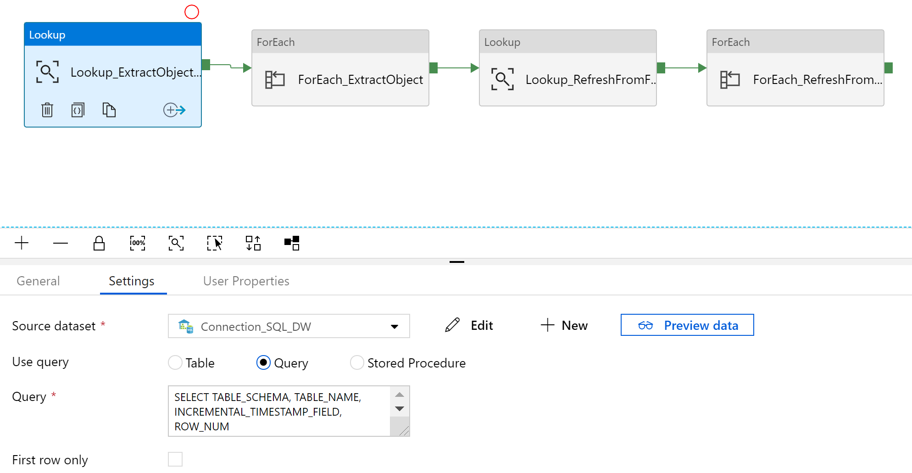
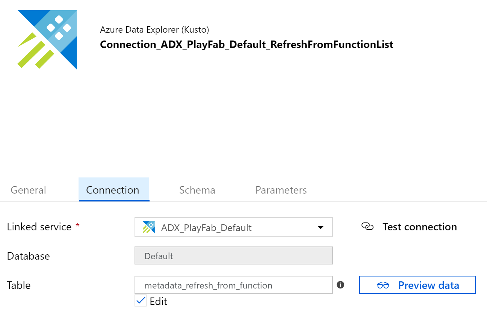

# PlayerCentricIntelligence

# Introduction 
Our goal was to shed light on user acquistion, in-game behavior, and app monetization by supplementing PlayFab event data with several complementary sources.

PlayFab's Azure Data Explorer database is vast, so we preferred to bring all other data to _it_, rather than vice-versa.

This project does so with a handful of Azure resources, most notably Data Factory. It also contains sample KQL queries that we used to model data and to validate it against the raw sources.

Note that our solutions begins with a relational database that Fivetran populates from API and S3 sources. We use SQL DW, but a standard Azure SQL DB should be a suitable and lower-cost alternative. You might bypass this by handling all connections through Azure Data Factory's HTTP connector, but we heartily recommend Fivetran as a simpler and more cost-effective alternative to maintaining often-volatile API connections.

# The Data Model

We've included (in _Model.zip_) some sample ADX queries that yield fact and dimension tables. We designed these specifically for the included dashboards, so most will not apply to all apps from all users. However, they do shed some light on how these sources can join to each other.

Speaking of joins, **every source must include PlayFab user IDs**. Otherwise, it may be possible to link users by some combination of device, location, and/or contact info, but that's a difficult and imprecise task.

A conformed model is generally not app-specific, by definition, so we wrote all of those queries to use the _Default_ DB. That's the target of the replication pipeline below. As of writing, ADX does not automatically update tables derived from other DBs, so our pipeline contains a workaround for refreshes (more on that later).

# Getting Started
Exact configuration depends heavily on which sources you use, but the general steps are:

1.	Connect Fivetran or your tool of choice from each raw source to a single, relational store.

2.	Create a data factory with linked services for :

    a)  SQL DW or your source data store of choice
    b)  Your target Azure Data Explorer cluster

3.	For each linked service, create a data set with a similar name. Note our dynamic table name in the ADX connection, which lets us use a single data set for all activities.

4.	In your source data store, create a metadata table/view with each desired object's schema name, object name, and incremental timestamp column name (or NULL). Azure Data Factory will iterate over this list to build commands dynamically.

5.  Create a Logic App and connect it to your target ADX cluster. The app will use the metadata list to query INFORMATION_SCHEMA for object names and columns to populate: 
                    `.drop table <name> ifexists` 
        followed by `.create table <name> (<columns list>)` to your ADX target. 
        
    Take note of the Logic App's POST URL, since that is how ADF will call it.
    *Note*: our "Lookup_GetColumnsList" maps some data types from SQL DW to ADX. This may need to change depending on your source (or our own potential mapping errors). Additionally, the query itself is a little convoluted due to limited SQL DW syntax, but should work _more or less_ as-is on most platforms. Other SQL implementations may allow for simpler syntax.

6.  If a source object is too large for its initial load, you may need to partition it in SQL DW. We found that a couple million rows per batch is a good starting point.
    
    a)  Exclude the main object (let's call it `mygame.events`) from the metadata view. If executed, this _would_ yield an ADX table called `mygame_events`.
    b)  Name your partitions something like `mygame.events_1`...`mygame.events_n`. Include them in the metadata view, but with a NULL incremental timestamp field name, which prevents the workflow from trying an incremental refresh.
    c)  Once all partitions are in ADX, consolidate them into `mygame_events` (exactly what the original, single table will be called). 
    d)  Remove the partitioned sources from the metadata view, then re-add the original `mygame.events` source to the view, and let the incremental refresh run from there on out.
    
    If incremental load row counts are slightly off, then check out _exactly_ how the SQL DW and ADX queries pass timestamps. ADX handles datetime values a little differently from T-SQL, so you may need to update our sample syntax for rounding/conversion issues.

7.  Once all raw objects are loaded into ADX, save any _derived_ table definitions as functions. This will facilitate updates in one of two ways:

    * If the derived table comes entirely from the target DB you've just populated, **and** updates are append-only, then create an update policy that uses the function as its query. If multiple raw tables feed the modeled one, be careful which you include in the update policy (for instance, dimensions that are dropped and recreated may trigger undesired appends).
    * If the the derived table is not **both** sourced from this DB alone **and** append-only, then create a second Logic App that uses the function to pass commands like `.set-or-replace <table> <| fn_<table>()>`. To specify tables to update in this manner, you could:
        
        a) Write a `.show functions | where ...` query that returns just the functions that cross databases or whose names contain "dim" (or whatever else indicates a non-append-only tables). Alternatively, you might want to create a merge-based approach to slowly-changing dimensions. We have not done this and cannot recommend a design pattern yet.
        
        b) Use an ADF _look-up activity_ to retrieve this.
        
        c) Feed the _look-up activity_ into a _for each activity_ that in turn calls the second Logic App.

# Build and Test
You'll probably need to modify this pipeline to suit your data and desired behavior. The reasons for some choices are not self-evident in the code, so below is a summary of _why_ we designed the pipeline the way we did.

1.  Your source metadata view should yield something like this:

2.  Note that our ADX connector uses a parameter (defined in the Parameters tab) for the table name. This lets us recycle the same connection.

3.  The pipeline contains four high-level sections: 

    * An initial _look-up_ activity gets all objects to extract
    * A *for each* activity iterates over the source object list
    * A second _look-up_ activity gets the ADX functions that define destructive refreshes
    * A second _for each_ activity iterates over the functions list

4.  To start, retrieve the source object metadata from the view mentioned above, then feed into into a *for each* activity with two inner activities.

5.  The first inner activity is a _look up_ that checks whether the source object exists in ADX (with the naming convention _<source schema name>_<source object name>_).

6.  After that _look-up_, an *if* condition checks whether an incremental timestamp field exists for that table, and routes it to the next branch depending on the answer.

7.  If the source **has** a matching ADX table with an incremental timestamp, then it gets its latest timestamp from ADX and copies from the source where the source timestamp is greater than the latest ADX timestamp.

8.  If the source **does not have** a matching ADX table with an incremental timestamp (i.e., destructive loads or totally new tables), then it retrieves metadata from the source, maps it to ADX types, passes the info to a Logic App that runs ADX control commands, and finally copies the data into ADX.

9.  All raw ADX tables should now be up to date with the source. For the next step, if applicable, make sure you have an ADX table that lists all functions from which to drop and rebuild tables. Consistent function naming (with consistent naming like _fn\_\<table name\>_) is extremely helpful in automating this part.

The _TableName_ dataset parameter we used earlier is unnecessary and a little tricky here, so create a new ADX connection explicitly to your functions list table.

10. The pipeline returns to its outermost layer to run another _look-up_ activity against the ADX functions list, then passes the list into a _for each_ activity.

11. The _for each_ activity passes each function name to another Logic App, which strips of the function prefix to generate and issue a `.set-or-replace` command in ADX.

